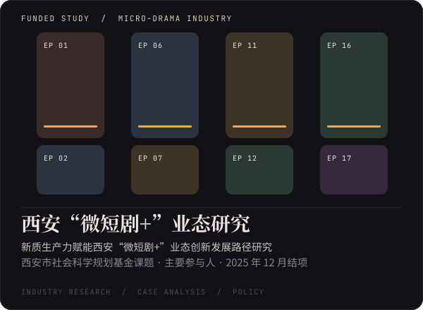

  

  陕西师范大学 戏剧与影视 硕士（2027 届） · 华中农业大学 数据科学与大数据技术 学士 
  2026 年 5 月至 10 月在 UCL 计算机系访问，参与人机交互方向研究 【待确认：访问身份称谓】 
  求职意向：<b>AI 产品运营 / AI 内容运营</b> 【待确认】

 

  
  

  
  

| 项目 | 是什么 | 入口 |
| --- | --- | --- |
| **MoCoCo** | 写下电影解说稿，系统找出匹配的镜头，自动粗剪、配音、加字幕，每一步都能改 | [在线试用](https://baixue-wu.github.io/MoCoCo/) · [代码](https://github.com/Baixue-Wu/MoCoCo) |
| **映游 CineAtlas** | 给旅行者的电影文化地图：选一个目的地，看看电影里当地人怎样生活 | [代码](https://github.com/Baixue-Wu/CineAtlas) · 【待补：在线地址】 |
| **InkMuse** | 把写好的文字自动排成好看的图文卡片，可逐页修改，有网页版和微信小程序 | [代码](https://github.com/Baixue-Wu/InkMuse) |
| **NextHook** | 创作者上传自己的内容数据表，按系列对比表现，规划下一条内容 | [代码](https://github.com/Baixue-Wu/NextHook) |

 

  

  

【待补：寂寞花芳与三支 AI 短片的观看链接】

 

  
  

  
  

- 《中日美赛博朋克动画色彩比较研究》，第一作者，《电影评介》（中文核心）
- 《喜剧电影票房影响因素研究》，独立作者，《喜剧世界》
- 《数字人文视角下贾樟柯地缘电影的文化研究》，第二届“地缘杯”中国电影青年学者优秀论文奖 三等奖（2024）
- 新质生产力赋能西安“微短剧+”业态创新发展路径研究，西安市社会科学规划基金课题，主要参与人，2025 年 12 月结项

## 其他荣誉

- 第 17 届全国大学生广告艺术大赛 陕西赛区 影视广告类 一等奖（2025，三人合作）

## 工具

**数据**　Python · pandas · scikit-learn · jieba · SnowNLP · LDA · 聚类与回归分析 
**AI**　即梦 · ChatGPT 生图 · 【待补：常用的 AI 工具与 Agent】 
**内容**　【待补：剪辑、设计等工具】

## 联系

baixuewu0@gmail.com · 【待补：意向城市 / 其他社交主页】

