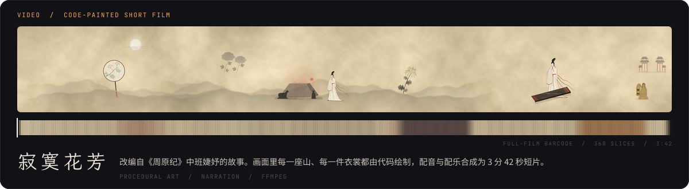

  

  数据科学本科 · 戏剧与影视硕士 · UCL 计算机系人机交互方向访问研究 
  我用算法拆解电影的色彩、情绪与票房，也用 AI 为创作者、写作者和旅行者做产品。 
  正在寻找 <b>AI 产品运营 / AI 内容运营</b> 的机会 【待确认：求职意向措辞】

 

  
  

  
  

 

  
  

  
  

  

 

| 作品 | 一句话 | 入口 |
| --- | --- | --- |
| **MoCoCo** | 写下解说稿，系统找出匹配的镜头，人和 AI 一起把电影解说做完 | [在线试用](https://baixue-wu.github.io/MoCoCo/) · [仓库](https://github.com/Baixue-Wu/MoCoCo) |
| **映游 CineAtlas** | 跟着电影，走进一个地方 | [仓库](https://github.com/Baixue-Wu/CineAtlas) · 【待补：在线地址】 |
| **InkMuse** | 好文字，值得被看见：文字自动排成图文卡片 | [仓库](https://github.com/Baixue-Wu/InkMuse) |
| **NextHook** | 从过去的内容数据里，找到下一条该试什么 | [仓库](https://github.com/Baixue-Wu/NextHook) |
| **寂寞花芳** | 代码绘制的古风短片 | [仓库](https://github.com/Baixue-Wu/Lonely-Flower-Fragrance) · 【待补：视频链接】 |

## 发表与荣誉

- 《中日美赛博朋克动画色彩比较研究》第一作者，《电影评介》（中文核心）
- 《喜剧电影票房影响因素研究》独立作者，《喜剧世界》
- 第二届“地缘杯”中国电影青年学者优秀论文奖 三等奖（2024）
- 第 17 届全国大学生广告艺术大赛 陕西赛区 影视广告类 一等奖（2025，三人合作）
- 西安市社会科学规划基金课题“新质生产力赋能西安‘微短剧+’业态创新发展路径研究”主要参与人，2025 年 12 月结项

## 工具箱

**数据**　Python · pandas · scikit-learn · jieba · SnowNLP · LDA · 聚类与回归分析 
**AI**　即梦 · ChatGPT 生图 · 【待补：常用的 AI 工具与 Agent】 
**内容**　【待补：剪辑、设计等工具】

## 联系

baixuewu0@gmail.com · 【待补：意向城市 / 其他社交主页】

